## poc简洁编写思路：

导入模块

用户输入url

利用代码（网站漏洞地址）

拼接

请求拼接后的链接

输入你要验证的信息（中文进行编码）

进行信息匹配 判断

得出结果

https://github.com/crown-prince/Python_PoC

https://github.com/Mr-xn/Penetration_Testing_POC


## dockerfile和docker-compose的区别和联系

先简单理解 docker 的使用过程，它分为镜像构建与容器启动。

镜像构建：即创建一个镜像，它包含安装运行所需的环境、程序代码等。这个创建过程就是使用 dockerfile 来完成的。

容器启动：容器最终运行起来是通过拉取构建好的镜像，通过一系列运行指令（如端口映射、外部数据挂载、环境变量等）来启动服务的。针对单个容器，这可以通过 docker run 来运行。

而如果涉及多个容器的运行（如服务编排）就可以通过 docker-compose 来实现，它可以轻松的将多个容器作为 service 来运行（当然也可仅运行其中的某个），并且提供了 scale (服务扩容) 的功能。


## Python Requests库的学习


```python
url='' #输入网址

r = requests.get(url)
print(r.text) #这时的输出会是网站的源代码，因为没有编码所以中文是乱的。
#正确
r = requests.get(url)
r.encoding = 'utf8'
print(r.text)


```


## Python BeautifulSoup库的学习

使用requests模块向网站发送http请求，获取到网页的HTML数据。

这时就需要使用BeautifulSoup模块来从HTML文本中提取我们想要的数据。

```python
s = BeautifulSoup(r.text,'html.parser')
li_list = s.select('li') #find_all与select相同
print(li_list) #会发现打印出来的是包含<li>的部分，需要去掉li

for li in li_list:
    print(li.text)

```


## python下载whl文件

Windows: 在 %APPDATA% 中新建 `pip` 文件夹并在其中新建配置文件`pip.ini`。 linux/macOS: 在用户目录下创建 `.pip` 文件夹，并在该文件中创建 `pip.conf`，完整路径为 `~/.pip/pip.conf`。

```ini
[global]
index-url = https://mirrors.aliyun.com/pypi/simple
[install]
trusted-host = mirrors.aliyun.com
```

### 离线安装与 whl 文件

whl 文件的格式为 The Wheel Binary Package Format 文件，是一种 Python 第三方库的“安装程序”。在无法联网时，可以通过直接下载该文件进行第三方库的安装。

- 一种压缩包，包含了 Python 第三方库安装所需文件和信息
- 有三种类型:
  - Universal Wheel，纯 Python 包，同时支持 Python2/Python3。
  - Pure Python wheel，纯 Python 包，不同时支持 Python2/Python3。
  - Platform Wheel，非纯 Python 包，包含编译后的平台相关文件。

*source: [PEP 427](https://www.python.org/dev/peps/pep-0427/) / [PEP 491](https://www.python.org/dev/peps/pep-0491/) / [FileInfo](https://fileinfo.com/extension/whl)*

### whl 命名规则

{distribution}-{version}(-{build tag})?-{python tag}-{abi tag}-{platform tag}.whl

| 字段         | 含义                                 |
| ------------ | ------------------------------------ |
| distribution | 包名称, e.g. 'django', 'requests'.   |
| version      | 包版本, e.g. 1.0.                    |
| build tag    | 可选构建标签. 数字开头               |
| python tag   | 语言版本, e.g. 'py27', 'py2', 'py3'. |
| abi tag      | e.g. 'cp33m', 'abi3', 'none'.        |
| platform tag | e.g. 'win32', 'any'.                 |

### 安装 whl 文件

whl 文件安装同样使用 `pip install`，比如下载 opencv_python 库以后：

```bash
pip install opencv_python-4.1.2+contrib-cp38-cp38-win_amd64.whl
```

`%PYTHON_PATH%\lib\site-packages`, 即 离线下载Python 安装路径下的 `lib\site-packages` 子目录。

当下载的第三方库都会放到 `lib\site-packages` 子目录下时，就会造成臃肿。

所以需要虚拟环境管理每一个python的项目，只编辑放到自己定义的目录下。

安装完成后即可使用 pipenv 以文件夹为单位来管理各个不同项目环境。

```bash
cd ~/workspace/demo     # 进入工作目录
pipenv install           # 初始化工作环境，创建 Pipfile
pipenv install numpy     # 安装所需要的包，如 numpy
pipenv run python xxx.py # 在工作环境中运行代码
pipenv shell             # 或者直接激活工作环境
python xxx.py            # 运行代码

会产生pipfile和pipfile.lock文件 下面代码讲解
```

```shell
# pipfile文件讲解
[[source]]  #源 下载的源
url = "https://mirrors.aliyun.com/pypi/simple"
verify_ssl = true
name = "aliyun_pypi"

[packages]      #运行依赖的库  *号 对版本没有要求
numpy = "*"
dlib = "*"

[dev-packages]  #开发情况下需要的库

[requires]
python_version = "3.8"  #版本
```

```shell
# pipfile.lock文件讲解   1.安全性有哈希值 2.版本更细致
{
  "_meta": {
    "hash": {
      "sha256": "f13c6b2ec40cc6e413412a0ab56b849b2a4d42c8ed803c298efe430e4f86ed14"
    },
    "pipfile-spec": 6,
    "requires": {
      "python_version": "3.6"
    },
    "sources": [
      {
        "name": "aliyun_pypi",  #源要和pipfile一样
        "url": "https://mirrors.aliyun.com/pypi/simple",
        "verify_ssl": true
      }
    ]
  },
  "default": {
    "dlib": {
      "hashes": [
        "sha256:ad5e9e6276d1486b8ef7383229379d759f155f7d2c703e67e3d84682fb2a93c5"
      ],
      "index": "aliyun_pypi",
      "version": "==19.15.0"
    },
    "numpy": {
      "hashes": [
        "sha256:1c362ad12dd09a43b348bb28dd2295dd9cdf77f41f0f45965e04ba97f525b864",
        "sha256:2156a06bd407918df4ac0122df6497a9c137432118f585e5b17d543e593d1587",
        "sha256:24e4149c38489b51fc774b1e1faa9103e82f73344d7a00ba66f6845ab4769f3f",
        "sha256:340ec1697d9bb3a9c464028af7a54245298502e91178bddb4c37626d36e197b7",
        "sha256:35db8d419345caa4eeaa65cd63f34a15208acd87530a30f0bc25fc84f55c8c80",
        "sha256:361370e9b7f5e44c41eee29f2bb5cb3b755abb4b038bce6d6cbe08db7ff9cb74",
        "sha256:36e8dcd1813ca92ce7e4299120cee6c03adad33d89b54862c1b1a100443ac399",
        "sha256:378378973546ecc1dfaf9e24c160d683dd04df871ecd2dcc86ce658ca20f92c0",
        "sha256:419e6faee16097124ee627ed31572c7e80a1070efa25260b78097cca240e219a",
        "sha256:4287104c24e6a09b9b418761a1e7b1bbde65105f110690ca46a23600a3c606b8",
        "sha256:549f3e9778b148a47f4fb4682955ed88057eb627c9fe5467f33507c536deda9d",
        "sha256:5e359e9c531075220785603e5966eef20ccae9b3b6b8a06fdfb66c084361ce92",
        "sha256:5ee7f3dbbdba0da75dec7e94bd7a2b10fe57a83e1b38e678200a6ad8e7b14fdc",
        "sha256:62d55e96ec7b117d3d5e618c15efcf769e70a6effaee5842857b64fb4883887a",
        "sha256:719b6789acb2bc86ea9b33a701d7c43dc2fc56d95107fd3c5b0a8230164d4dfb",
        "sha256:7a70f2b60d48828cba94a54a8776b61a9c2657a803d47f5785f8062e3a9c7c55",
        "sha256:7b9e37f194f8bcdca8e9e6af92e2cbad79e360542effc2dd6b98d63955d8d8a3",
        "sha256:83b8fc18261b70f45bece2d392537c93dc81eb6c539a16c9ac994c47fc79f09a",
        "sha256:9473ad28375710ab18378e72b59422399b27e957e9339c413bf00793b4b12df0",
        "sha256:95b085b253080e5d09f7826f5e27dce067bae813a132023a77b739614a29de6e",
        "sha256:98b86c62c08c2e5dc98a9c856d4a95329d11b1c6058cb9b5191d5ea6891acd09",
        "sha256:a3bd01d6d3ed3d7c06d7f9979ba5d68281f15383fafd53b81aa44b9191047cf8",
        "sha256:c81a6afc1d2531a9ada50b58f8c36197f8418ef3d0611d4c1d7af93fdcda764f",
        "sha256:ce75ed495a746e3e78cfa22a77096b3bff2eda995616cb7a542047f233091268",
        "sha256:dae8618c0bcbfcf6cf91350f8abcdd84158323711566a8c5892b5c7f832af76f",
        "sha256:df0b02c6705c5d1c25cc35c7b5d6b6f9b3b30833f9d178843397ae55ecc2eebb",
        "sha256:e3660744cda0d94b90141cdd0db9308b958a372cfeee8d7188fdf5ad9108ea82",
        "sha256:f2362d0ca3e16c37782c1054d7972b8ad2729169567e3f0f4e5dd3cdf85f188e"
      ],
      "index": "aliyun_pypi",
      "version": "==1.15.1"
    }
  },
  "develop": {}
}
```

`pipenv install requests --skip-lock` 就会跳过，不会生成pipenv.lock文件

得到别人的py项目文件，如果是用虚拟环境编写，直接`pipenv install`搭建项目。

`pipenv shell`进入虚拟环境。`python 文件名.py`启动。

[学习视频](https://www.bilibili.com/video/BV1B541147ub?spm_id_from=333.999.0.0)


### 示例

1.创建写python的专门文件夹`pythoncode`

2.再此文件夹下创建本次需要的python文件名字 eg.`bilibili`

3.pipenv install 生成pipfile和pipfile.lock

4.code ./ 命令行启动vscode

5.进入vscode 启动   `pipenv install`搭建项目

6.下载库

   PS F:\pythoncode\bilibili> pipenv install requests

   PS F:\pythoncode\bilibili> pipenv install beautifulsoup4

```shell
PS F:\> cd pythoncode
PS F:\pythoncode> mkdir bilibili

Mode                 LastWriteTime         Length Name
----                 -------------         ------ ----
d-----         2021/9/15     16:37                bilibili


PS F:\pythoncode> cd bilibili
PS F:\pythoncode\bilibili> ls
PS F:\pythoncode\bilibili> pipenv install
Creating a virtualenv for this project...
Pipfile: F:\pythoncode\bilibili\Pipfile
Using C:/Users/牛杰恒/AppData/Local/Programs/Python/Python38/python.exe (3.8.8) to create virtualenv...
[   =] Creating virtual environment...created virtual environment CPython3.8.8.final.0-64 in 3482ms
  creator CPython3Windows(dest=C:\Users\牛杰恒\.virtualenvs\bilibili-_OAhhkFm, clear=False, no_vcs_ignore=False, global=False)
  seeder FromAppData(download=False, pip=bundle, setuptools=bundle, wheel=bundle, via=copy, app_data_dir=C:\Users\牛杰恒\AppData\Local\pypa\virtualenv)
    added seed packages: pip==21.2.3, setuptools==57.4.0, wheel==0.37.0
  activators BashActivator,BatchActivator,FishActivator,PowerShellActivator,PythonActivator

Successfully created virtual environment!
Virtualenv location: C:\Users\牛杰恒\.virtualenvs\bilibili-_OAhhkFm
Creating a Pipfile for this project...
Pipfile.lock not found, creating...
Locking [dev-packages] dependencies...
Locking [packages] dependencies...
Updated Pipfile.lock (db4242)!
Installing dependencies from Pipfile.lock (db4242)...
  ================================ 0/0 - 00:00:00
To activate this project's virtualenv, run pipenv shell.
Alternatively, run a command inside the virtualenv with pipenv run.
PS F:\pythoncode\bilibili> ls


    目录: F:\pythoncode\bilibili


Mode                 LastWriteTime         Length Name
----                 -------------         ------ ----
-a----         2021/9/15     16:48            138 Pipfile
-a----         2021/9/15     16:48            453 Pipfile.lock


PS F:\pythoncode\bilibili> code ./       #打开vscode

打开vscode
PS F:\pythoncode\bilibili> pipenv shell
Launching subshell in virtual environment...
Windows PowerShell

尝试新的跨平台 PowerShell https://aka.ms/pscore6

PS F:\pythoncode\bilibili> pipenv shell
Shell for C:\Users\牛杰恒\.virtualenvs\bilibili-_OAhhkFm already activated.  
No action taken to avoid nested environments.     #重复第二次pipenv shell 显示已经启动成功。

PS F:\pythoncode\bilibili> pipenv install requests
Installing requests...
Adding requests to Pipfile's [packages]...
Pipfile.lock (db4242) out of date, updating to (fbd99e)...
Locking [dev-packages] dependencies...
Locking [packages] dependencies...
 Locking...
Resolving dependencies...
Success!
Updated Pipfile.lock (fbd99e)!
Installing dependencies from Pipfile.lock (fbd99e)...
  ================================ 0/0 - 00:00:00
  
PS F:\pythoncode\bilibili> pipenv install beautifulsoup4
Installing beautifulsoup4...
Adding beautifulsoup4 to Pipfile's [packages]...
Installation Succeeded
Pipfile.lock (fbd99e) out of date, updating to (1ffca6)...
Locking [dev-packages] dependencies...
Locking [packages] dependencies...
Building requirements...
Resolving dependencies...
Success!
Updated Pipfile.lock (1ffca6)!
Installing dependencies from Pipfile.lock (1ffca6)...
  ================================ 0/0 - 00:00:00
```


## Ubuntu与Centos的区别

|          操作内容          | Centos 6/7                                                   | Debian/Ubuntu                                                |
| :------------------------: | :----------------------------------------------------------- | :----------------------------------------------------------- |
|        1.软件包后缀        | *.rpm                                                        | *.deb                                                        |
|      2.软件源配置文件      | /etc/yum.conf                                                | /etc/apt/sources.list                                        |
|      3.更新软件包列表      | yum makecache fast                                           | apt-get update                                               |
|    4.从软件仓库安装软件    | yum install package                                          | apt-get install package                                      |
|  5.安装一个已下载的软件包  | yum install pkg.rmp  rpm -i pkg.rpm                          | dpkg -i pkg.deb  pkg --install pkg.deb                       |
|        6.删除软件包        | rpm -e package  yum remove package                           | apt-get remove package  apt-get purge package                |
|   7.获取某软件包的信息**   | yum search package                                           | apt-cache search package                                     |
|  8.获显示所有已经安装软件  | yum list instakked rpm -qa                                   | dpkg -l dpkg --list                                          |
| 9.获取已经安装软件包的信息 | rpm -qi package                                              | dpkg --status packages                                       |
|      10.网卡配置文件       | /etc/sysconfig/network-scripts/ifcfg-eth0                    | /etc/network/interfaces                                      |
|         11.selinux         | /etc/selinux/config                                          | 没有 selinux                                                 |
|           12.SSH           | 默认允许 root 登陆                                           | 默认不允许 root 登陆                                         |
|        13.创建用户         | 默认创建用户家目录 默认 shell 解释器为 bash 免交互创建密码--stdin | 默认不创建用户家目录 默认 shell 解释器为 sh 免交互创建密码 chpasswd |
|       14.防火墙规则        | 默认规则                                                     | 默认没有任何规则                                             |
|          15.权限           | root 或普通用户                                              | 默认普通用户权限                                             |

https://mp.weixin.qq.com/s/yfg143MfMMxLusOy133_3w


## shell脚本

#! /usr/bin/env bash  声明是一个脚本文件 通过/usr/bin/env打开执行

类似的我们可以在 Python 脚本文件行首书写

```
#!/usr/bin/env python
```

```shell
chmod +x ./test.sh  #使脚本具有执行权限
./test.sh  #执行脚本
```

- 查看当前shell解释器对应的文件绝对路径

```
type bash
```

- 查看当前bash的版本号

```
bash --version
```


REPL


注意：

```shell
#变量名和等号之间不能有空格，这可能和你熟悉的所有编程语言都不一样。同时，变量名的命名须遵循如下规则：
#命名只能使用英文字母，数字和下划线，首个字符不能以数字开头。
#中间不能有空格，可以使用下划线 _。
#不能使用标点符号。
#不能使用bash里的关键字（可用help命令查看保留关键字）。
 有效shell变量：
    RUNOOB
    LD_LIBRARY_PATH
    _var
    var2
  无效的变量命名：
    ?var=123
	user*name=runoob


#表达式和运算符之间要有空格，例如 2+2 是不对的，必须写成 2 + 2，这与我们熟悉的大多数编程语言不一样。
#完整的表达式要被 ` ` 包含，注意这个字符不是常用的单引号，在 Esc 键下边。
val=`expr 2 + 2`
echo "两数之和为 : $val"

#条件表达式要放在方括号之间，并且要有空格，
例如: [$a==$b] 是错误的，必须写成 [ $a == $b ]

#赋值的时候，不能等号两边不能有空格
result=$[a+b] # 注意等号两边不能有空格

#shell 语言中 0 代表 true，0 以外的值代表 false。
```


https://www.runoob.com/linux/linux-shell-include-file.html

https://www.bilibili.com/video/BV1Hb4y1R7FE?p=65


## 管道

 管道可以把一系列命令连接起来。这意味着第一个命令的输出会通过管道传给第二个命令而作为第二个命令的输入，第二个命令的输出又会作为第三个命令的输入，以此类推。而管道行中最后一个命令的输出才会显示在屏幕上（如果命令行里使用了输出重定向的话，将会放进一个文件里）。
  你能通过使用管道符 | 来建立一个管道行，下面的示例就是一个管道行：

cat sample.text | grep "High" | wc -l

  这个管道将把 cat 命令（列出一个文件的内容）的输出送给grep命令。grep 命令在输入里查找单词 High，grep命令的输出则是所有包含单词 High的行，这个输出又被送给 wc命令。带 -l选项的 wc命令将统计输入里的行数。假设 sample.txt的内容如下：

Things to do today:

Low: Go grocery shopping

High: Return movie

High: Clear level 3 in Alien vs. Predator

Medium: Pick up clothes from dry cleaner


 管道行将返回结果 2，指出你今天有两件很重要的事要做：

cat sample.text | grep "High" | wc -l

2


## curl 命令

在Linux中curl是一个利用URL规则在命令行下工作的文件传输工具。

```bash
-x/--proxy <host[:port]>       在给定的端口上使用HTTP代理
-d/--data <data>	           HTTP POST方式传送数据
   --data-ascii <data>	       以ascii的方式post数据
   --data-binary <data>	       以二进制的方式post数据
   --negotiate	               使用HTTP身份验证
   --digest	                   使用数字身份验证
   --disable-eprt	           禁止使用EPRT或LPRT
   --disable-epsv	           禁止使用EPSV
-H/--header <line>	           自定义头信息传递给服务器
   --ignore-content-length	   忽略的HTTP头信息的长度
```

https://man.linuxde.net/curl


## 反弹shell

控制端监听在某TCP/UDP端口，被控端发起请求到该端口，并将其命令行的输入输出转到控制端。

会用到kali的Netcat工具。

**正向连接:**

假设我们攻击了一台机器，打开了该机器的一个端口，攻击者在自己的机器去连接目标机器（目标ip：目标机器端口），这是比较常规的形式，我们叫做正向连接。远程桌面、web服务、ssh、telnet等等都是正向连接。

**反向连接:**

反弹shell通常适用于如下几种情况：

- 目标机因防火墙受限，目标机器只能发送请求，不能接收请求。
- 目标机端口被占用。
- 目标机位于局域网，或IP会动态变化，攻击机无法直接连接。
- 对于病毒，木马，受害者什么时候能中招，对方的网络环境是什么样的，什么时候开关机，都是未知的。

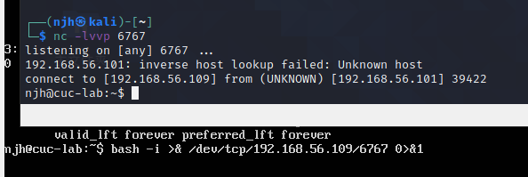


https://www.cnblogs.com/LittleHann/p/12038070.html

https://zhuanlan.zhihu.com/p/138393396

https://whoamianony.top/2021/01/28/%E6%B8%97%E9%80%8F%E6%B5%8B%E8%AF%95/%E5%8F%8D%E5%BC%B9Shell%EF%BC%8C%E7%9C%8B%E8%BF%99%E4%B8%80%E7%AF%87%E5%B0%B1%E5%A4%9F%E4%BA%86/

https://cyto.top/2019/03/30/reverse-shell-simple/


## Netcat

**功能说明：**端口扫描、端口监听、远程文件传输、远程shell等等;

**语　　法：**`nc  [-hlnruz][-g<网关...>][-G<指向器数目>][-i<延迟秒数>][-o<输出文件>][-p<通信端口>][-s<来源位址>][-v...][-w<超时秒数>][主机名称][通信端口...]`

**参　　数：**

```bash
-g <网关> 设置路由器跃程通信网关，最多可设置8个；

-G <指向器数目> 设置来源路由指向器，其数值为4的倍数；

-h 在线帮助； 

-i <延迟秒数> 设置时间间隔，以便传送信息及扫描通信端口；

-l 使用监听模式，管控传入的资料；

-n 直接使用IP地址，而不通过域名服务器；

-o <输出文件> 指定文件名称，把往来传输的数据以16进制字码倾倒成该文件保存；

-p <通信端口> 设置本地主机使用的通信端口；

-r 乱数指定本地与远端主机的通信端口；

-s <来源位址> 设置本地主机送出数据包的IP地址；

-u 使用UDP传输协议；

-v 显示指令执行过程；

-w <超时秒数> 设置等待连线的时间；

-z 使用0输入/输出模式，只在扫描通信端口时使用。
```

**简易使用**

连接到远程主机：`nc  -nvv Targert_IP  Targert_Port`

监听本地主机：`nc  -l  -p  Local_Port`

特性被滥用或误用导致的漏洞：(功能)

- 文件上传
- XXE
- 文件包含
- 反序列化

https://www.freebuf.com/sectool/168661.html


GET       对这个资源的查操作

POST    向指定资源提交数据进行处理请求（例如提交表单或者上传文件）。数据被包含在请求体中。POST请求可能会导致新的资源的建立和/或已有资源的修改。（适用于更新操作）

PUT      从客户端向服务器传送的数据取代指定的文档的内容。（适用于添加操作）


面向过程：函数

面向对象：方法

其实都一样


ysoserial 是一款非常好用的 Java 反序列化漏洞检测工具，该工具通过多种机制构造 PoC ，并灵活的运用了反射机制和动态代理机制，值得学习和研究。


## 关于Java安全的学习

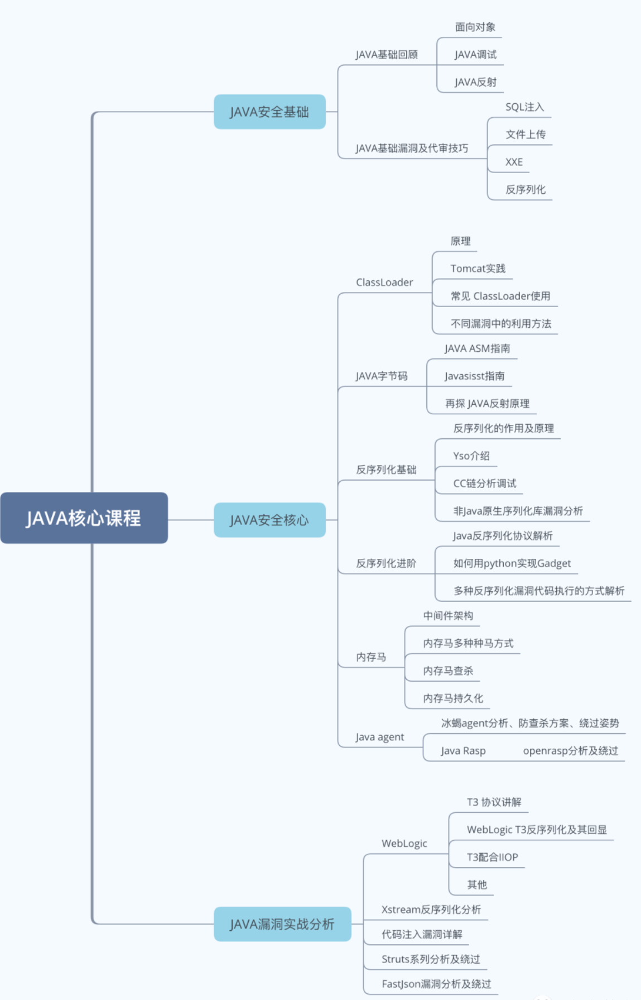

下载IDEA

```java
#学习快捷方式

创造main函数 输入psvm
public static void main(String[] args) {
        
    }
打印输出 sout
System.out.println();
```


反序列化漏洞，原理，常见的解析，如何生成反序列化漏洞攻击的payload，Java内存马，Java agent

Java agent，主要是rasp的插桩检测

了解Java流协议

jvm的解析过程


内存码和中间件没学


[大牛都在用的IDEA调试技巧](https://zhuanlan.zhihu.com/p/115823713)

[java基础](https://github.com/Snailclimb/JavaGuide/blob/master/docs/java/basis/%E5%8F%8D%E5%B0%84%E6%9C%BA%E5%88%B6.md)

[IntelliJ IDEA技巧 Java安全的书](https://www.bookstack.cn/read/anbai-inc-javaweb-sec/README.md)

[红蓝必备 你需要了解的weblogic攻击手法](https://mp.weixin.qq.com/s?__biz=MzUzNTEyMTE0Mw==&mid=2247484559&idx=1&sn=a9054c0a433cb288df2820363a889446&scene=21#wechat_redirect)

[内存马](https://www.freebuf.com/articles/web/274466.html)

[某weblogic的T3反序列化0day分析](https://mp.weixin.qq.com/s?__biz=MzUzNTEyMTE0Mw==&mid=2247484639&idx=1&sn=718ae37e6ee9db1583faf634cc943b24&scene=21#wechat_redirect)

[未授权访问分析](https://mp.weixin.qq.com/s?__biz=MzUzNTEyMTE0Mw==&mid=2247484305&idx=1&sn=d655323522c1855881f0beb237d853c1&scene=21#wechat_redirect)

[weblogic cve漏洞捡漏指南](https://mp.weixin.qq.com/s?__biz=MzUzNTEyMTE0Mw==&mid=2247484671&idx=1&sn=e41f5b7a8a49e9f0d68e13a278d05436&scene=21#wechat_redirect)

[java执行shellcode的几种方法](https://mp.weixin.qq.com/s?__biz=MzUzNTEyMTE0Mw==&mid=2247484630&idx=1&sn=5d911558674ba5a210988df35addb3eb&scene=21#wechat_redirect)

[基于javaAgent内存马检测查杀指南](https://mp.weixin.qq.com/s?__biz=MzUzNTEyMTE0Mw==&mid=2247484605&idx=1&sn=9b06ac2628024baffb45ef6b03d84a02&scene=21#wechat_redirect)

[某C 1day 反序列化漏洞的武器级利用](https://mp.weixin.qq.com/s?__biz=MzUzNTEyMTE0Mw==&mid=2247484579&idx=1&sn=c3d5b137408ba52564c07156e8a768d7&scene=21#wechat_redirect)

[蓝军反治系列之打造weblogic的持久化内存马后门](https://mp.weixin.qq.com/s?__biz=MzUzNTEyMTE0Mw==&mid=2247484570&idx=1&sn=19ec45234243d3274c130336589d18e2&scene=21#wechat_redirect)

[javaagent](https://www.cnblogs.com/rickiyang/p/11368932.html)


## Java 反序列化

### 概述

序列化就是把对象转换成字节流或文本数据，便于保存在内存、文件、数据库中；反序列化即逆过程，由字节流或文本数据还原成对象。一般用于远程调用、通过网络将对象传输至远程服务器、存储对象到数据库或本地等待重用等场景中。Java中的 `ObjectOutputStream` 类的 `writeObject()` 方法可以实现序列化，类 `ObjectInputStream` 类的 `readObject()` 方法用于反序列化。如果要实现类的反序列化，则是对其实现 `Serializable` 接口。还有一种Externalizable接口(该接口仅仅是一个标记接口，并不包含任何方法)

### 漏洞原因

序列化和反序列化本身并不存在问题。但当输入的反序列化的数据可被用户控制，那么攻击者即可通过构造恶意输入，让反序列化产生非预期的对象，在此过程中执行构造的任意代码。

当远程服务接受不可信的数据并进行反序列化且当前环境中存在可利用的类时，就认为存在反序列化漏洞。

总结：漏洞产生的原因是反序列化时没有进行校验，或者有些校验使用黑名单方式又被绕过，最终使得包含恶意代码的序列化对象在服务器端被反序列化执行。

### 应用场景

HTTP：多平台之间的通信，管理等。

游戏的进度存档(序列化)与读档(反序列化)

RMI(远程调用)：是 Java 的一组拥护开发分布式应用程序的 API，实现了不同操作系统之间程序的方法调用。值得注意的是，RMI 的传输 100% 基于反序列化，Java RMI 的默认端口是 1099 端口。

JMX：JMX 是一套标准的代理和服务，用户可以在任何 Java 应用程序中使用这些代理和服务实现管理,中间件软件 WebLogic 的管理页面就是基于 JMX 开发的，而 JBoss 则整个系统都基于 JMX 构架。

### 需要序列化的三种方法

假定一个User类，它的对象需要序列化，可以有如下三种方法：

1.若User类仅仅实现了Serializable接口，则可以按照以下方式进行序列化和反序列化。

- ObjectOutputStream采用默认的序列化方式，对User对象的非transient的实例变量进行序列化。
- ObjcetInputStream采用默认的反序列化方式，对对User对象的非transient的实例变量进行反序列化。

2.若User类仅仅实现了Serializable接口，并且还定义了readObject(ObjectInputStream in)和writeObject(ObjectOutputSteam out)，则采用以下方式进行序列化与反序列化。

- ObjectOutputStream调用User对象的writeObject(ObjectOutputStream out)的方法进行序列化。
- ObjectInputStream会调用User对象的readObject(ObjectInputStream in)的方法进行反序列化。

3.若User类实现了Externalnalizable接口，且User类必须实现readExternal(ObjectInput in)和writeExternal(ObjectOutput out)方法，则按照以下方式进行序列化与反序列化。

- ObjectOutputStream调用User对象的writeExternal(ObjectOutput out))的方法进行序列化。
- ObjectInputStream会调用User对象的readExternal(ObjectInput in)的方法进行反序列化。

### 如何发现Java反序列化漏洞

1.从流量中发现序列化的痕迹，关键字：`ac ed 00 05`，`rO0AB`

2.Java RMI 的传输 100% 基于反序列化，Java RMI 的默认端口是`1099`端口

3.从源码入手，可以被序列化的类一定实现了`Serializable`接口

4.观察反序列化时的`readObject()`方法是否重写，重写中是否有设计不合理，可以被利用之处

### 注意事项

1、当一个父类实现序列化，子类就会自动实现序列化，不需要显式实现Serializable接口。

2、当一个对象的实例变量引用其他对象，序列化该对象时也把引用对象进行序列化。

3、并非所有的对象都可以进行序列化，比如：

​       安全方面的原因，比如一个对象拥有private，public等成员变量，对于一个要传输的对象，比如写到文件，或者进行RMI传输等等，在序列化进行传输的过程中，这个对象的private等域是不受保护的；

​       资源分配方面的原因，比如socket，thread类，如果可以序列化，进行传输或者保存，也无法对他们进行重新的资源分配，而且，也是没有必要这样实现。

4、声明为static和transient类型的成员变量不能被序列化。因为static代表类的状态，transient代表对象的临时数据。

5、序列化运行时会使用一个称为 **serialVersionUID** 的版本号，并与每个可序列化的类相关联，该序列号在反序列化过程中用于验证序列化对象的发送者和接收者是否为该对象加载了与序列化兼容的类。如果接收者加载的该对象的类的 serialVersionUID 与对应的发送者的类的版本号不同，则反序列化将会导致 InvalidClassException。

6、Java有很多基础类已经实现了serializable接口，比如String，Vector等。但是也有一些没有实现serializable接口的。

7、如果一个对象的成员变量是一个对象，那么这个对象的数据成员也会被保存！这是能用序列化解决深拷贝的重要原因。

[Java JNDI 注入原理与高 JDK 版本绕过](http://j0k3r.top/2020/08/11/java-jndi-inject/#1-%E4%BB%80%E4%B9%88%E6%98%AF-JNDI-%EF%BC%9F)

[理解jndi注入与Java反序列化漏洞的利用](https://kingx.me/Exploit-Java-Deserialization-with-RMI.html)

[知乎 Java反序列化安全漏洞](https://www.zhihu.com/question/37562657)

[ms08067实验室关于java反序列化的基础讲解](https://www.bilibili.com/video/BV1G44y1175E?from=search&seid=7370954135463374385)

[黄老师关于网络安全的课程](https://www.bilibili.com/video/BV1ay4y1r7vy?p=23)

[腾讯云关于序列化与反序列化的解释](https://cloud.tencent.com/developer/article/1511793)

[知道创宇 浅谈java反序列化](https://paper.seebug.org/792/#_1)


## Java基础

### 方法

类似于其他语言的函数

system.out.println()

类.对象.方法

```java
public class demo01{
    public static void main(String[] args){
        //实际参数：实际调用传递给他的参数
        int sum = add(1,2);
        System.out.println(sum);
    }
    public static int add(int a,int b){
        //形式参数，用来定义作用的
        return a+b;
    }
}
```

方法是解决一类问题的步骤的有序组合；包含于类或对象中；再程序中被创建，在其他地方被引用。

一个方法只完成一个功能

```java
public class demo02{
    public static void main(String[] args){
		int max = max(10,10);
        System.out.println(max);
     public static int max(int num1,int num2){
         int result = 0;
         if (num1==num2){
             System.out.println("num1==num2")
             return 0;//终止方法
         }
         if (num1>num2){
             result = num1;
         }else{
             result = num2;
         }
         return result;
     }   
}
```

方法的重载：方法名称必须相同；参数列表必须不同(个数不同、或类型不同、参数排列顺序不同等)；仅仅返回类型不同不足以成为方法的重载。

println就是重载 可以看源码

可变参数：传递同类型可变参数给一个方法；在指定参数类型后加一个省略号(...)；一个方法中只能指定一个可变参数，它必须是方法的最后一个参数(任何普通参数必须在它之前声明)。

属性+方法=类

```java
//Demo02.java
pubilc class Demo02{
    public static void main(String[] args){
        Student.say();
    }
}

//Student.java
//学生类
pubilc class Student{
    //静态方法 static
    public static void say(){
       System.out.println("学生说话了");
    }
}
//如果把Student.java中的静态方法static去掉，就是一个非静态方法，此时Demo02.java就会报错。 这个时候就需要把Demo02.java进行实例化。

//Demo02.java实例化修改
pubilc class Demo02{
    public static void main(String[] args){
        //实例化这个类new new Student().say();
        //一般写为 对象类型 对象名 = 对象值
        Student student = new Student();
        student.say(); //对象的名字.say() 
    }
}

//Student.java
//学生类
pubilc class Student{
    //非静态方法
    public void say(){
       System.out.println("学生说话了");
    }
}

```

static和class一起加载的，b(非静态)是类实例化之后才存在。 所以一下这样会出错。

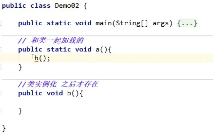

引用传递与值传递

```java
public class Demo05{
    public static void main(String[] args){
        Person person = new Person();
    	System.out.println(person.name);//null
    	Demo05.change(person);
    	System.out.println(person.name);//小李
    }
    public static void change(Person person){
        //person是一个对象：指向的-->Person person = new Person()；这是一个具体的人，可以改变属性！
        person.name="小李";
        //如果写 person="小李" 或 name="小李"就没有用
    }

}
//定义了一个Person类，有一个属性：name
class Person{
    String name;//null
}


```


类是一种抽象的数据类型，他是对某一类事物整体描述/定义，但是并不能代表某一个具体的事物。（动物、植物、手机、电脑...  Person类、Pet类、Car类等等）

对象是抽象概念的具体实例。(张三是人的一个具体实例)


### 面向对象

OOP 面向对象编程    OO面向对象

面向对象：总体分类，处理不同的事情。

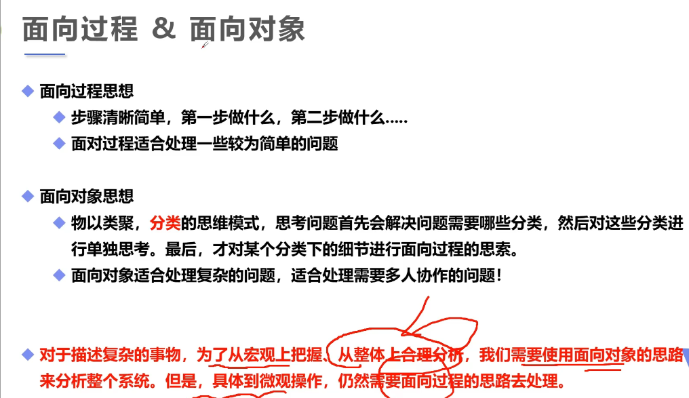


**面向对象编程的本质：以类的方式组织代码，以对象的组织(封装)数据。**


三大特性：封装、继承、多态(不同的人去学习表现出来是不一样的:多态)

从认识论角度考虑是现有对象后又类。对象，是具体的事物。类，是抽象的，对对象的抽象。(一群人组成这个班的学生，每一个人就是对象(是具体的)，统称为学生就是类是抽象的。)

从代码运行角度考虑是先有类后有对象。类是对象的模板。(你先需要定义出这一类才可以具体下面的细化工作。)

```java
//APP.java 一个项目只有一个main的主函数 单独创建出来
public class APP{
    public static void main(String[] args){
        //类：抽象的，实例化
        //类实例化后会返回一个自己的对象！
        //student对象就是一个Student类的具体实例！ 以对象的方式封装数据
        Student xiaoming = new Student();
        Student xh = new Student();
        
        //new关键字创建对象时，除了分配内存空间，还要进行默认的初始化(下面就是)，以及对类构造器的调用
        xiaoming.name="小明";
        xiaoming.age=3;
        
        System.out.println(xiaoming.name);//小明
        System.out.println(xiaoming.age);//3
        
        xh.name="小红"；
        xh.age=3;
        
        System.out.println(xh.name);//小红
        System.out.println(xh.age);//3
    }
}

//Student.java  组织代码
//学生类
public class Student{
    //属性：字段
    String name;//null
    int age;//0
    
    //方法
    public void study(){
        System.out.println(this.name+"在学习")
    }
}
```

关于构造器

构造器：和类名相同；没有返回值。

作用：new本质在调用构造方法；初始化对象的值。

注意点：定义有参构造后，如果想使用无参构造，显示的定义一个无参的构造。

```java
//APP.java
public class APP{
    public static void main(String[] args){
        //new实例化了一个对象
        Person person = new Person("xiaoli");
        
        System.out.println(person.name);
    }
}

//Person.java
public class Person{
    
    //一个类即使什么都不写，它也会存在一个方法
    //显示的定义构造器
    string name;
    
    //1.使用new关键字，本质是在调用构造器
    //2.用来初始化值
    public Person(){
     
    }
    //有参构造；一旦定义了有参构造，无参就必须显示定义
    public Person(String name){
        this.name=name;
    }
}

```

### 封装

**“高内聚，低耦合”**    **属性私有，get/set**

类的内部数据操作细节自己完成，不允许外部干涉；仅暴露少量的方法给外部使用。

1.提高程序的安全性，保护数据

2.隐藏代码的实现细节

3.统一接口

4.系统可维护增加了

```java
//Student.java
//类  private:私有
public class Student{
    //封装大多对于属性而言，属性私有
    private String name;//名字 
    private int id;//学号
    private char sex;//性别
    private int age;//年龄
    //方法
    //学习()
    //睡觉()
    
    //提供一些可以操作这个属性的方法
    //提供一些public的get、set方法
    
    //get 获得这个数据
    public String getName(){
        return this.name;
    }
    //set给这个数据设置值
    public void setName(String name){
        this.name = name;
    }
    public int getAge(){
        return age;
    }
    public void setAge(int age){
        if (age>90 || age<0){//不合法
            this.age = 3;
        }else{
            this.age = age;
        }
    }
}


//APP.java
public class APP{
    public static void main(String[] args){
        Student s1 = new Student();
        //如果 s1.name = "sdd" 会报错因为name已经被私有“private”
        //如果是public String name；就可以s1.name = "sdd"
        //因此才需要上面提供一些public的get、set方法。
        s1.setName("xiaoli")
        System.out.println(s1.getName());
        
        s1.setAge(-1);//不合法 返回3
        System.out.println(s1.getAge());
    }
}

```

### 继承

继承是类和类之间的一种关系，类和类之间的关系还有依赖、组合、聚合。

子类继承了父类，就会拥有父类的全部方法！

Java中类只有单继承，没有多继承！

**在Java中所有类都直接或间接继承object**   可以去看源码

```java
//Person.java  父类
public class Person{
    //public公共的
    //若设置私有的需要封装才可以子类引用
    public int money = 10000;
    public void say(){
        System.out.println("说了一句话")
    }
}
//Student.java  派生类，子类
public class Student extends Person{
}
//Teacher.java  派生类，子类
public class Teacher extends Person{
}


//APP.java
public class APP{
    public static void main(String[] args){
        Student student = new Student();
        student.say();
        System.out.println(student.money)
    }
}
```


### 接口

extends:单继承    （接口可以多继承）

现在大都是 ：面向接口编程    约束和实现分离

声明类的关键字是class，声明接口的关键字是interface

```java
//UserService.java
//interface 定义的关键字，接口都需要有实现类。
public interface UserService{
    //接口中的所有定义其实都是抽象的public abstract
    void add(String name);
    void delete(String name);
    void update(String name);
    void query(String name);
}


//UserServiceImpl.java
//抽象类：extends
//类 可以实现接口 implements 接口
//实现了接口的类，就需要重写接口中的方法
public class UserServiceImpl implements UserService{
    @Override
    public void add(String name){
        
    }
     public void delete(String name){
        
    }
     public void update(String name){
        
    }
     public void query(String name){
        
    }
}

```


### 异常机制

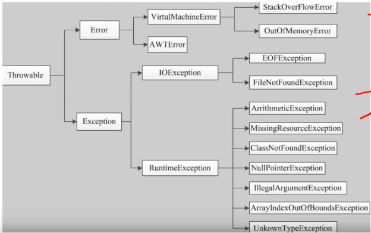

异常处理五个关键字：try、catch、finally、throw、throws

```java
public class Test{
    public static void main(String[] args){
        int a=1;
        int b=0;
        
        //捕获多个异常：从小到大。 加多个catch
        try{//try 监控区域
            System.out.println(a/b);
        }catch (ArithmeticException e){ //catch捕获异常 '( )'中的是报出异常或错误的名称
            System.out.println("程序出现异常，变量b不能为0")；
        }finally{//处理善后工作
            System.out.println("finally")；
        }
        //fianlly 可以不要finally 假设IO，资源，需要关闭。
    }
    
    public void a(){
        b();
    }
    public void b(){
        a();
    }
    
}
```

主动抛出异常：throw

```java
关于throw
public class Test{
    public static void main(String[] args){
        
        new Test().test(1,0)
  
        }
     public void test(int a,int b){
         if (b==0){
             throw new ArithmeticException();//主动抛出异常,一般在方法中。
         }
         System.out.println(a/b);
     } 
}

关于throws
public class Test{
    public static void main(String[] args){
        
        try{
            new Test().test(1,0);
        }catch (ArithmeticException e){
            e.printStackTrace();
        }
    }
     //假设这方法中，处理不了这个异常。方法上抛出。
     public void test(int a,int b) throws ArithmeticException{
         if (b==0){
             throw new ArithmeticException();
         }
         System.out.println(a/b);
     } 
}

```


### 注解和反射

> 注解


> 反射

动态：

```javascript
function f(){
    var x = "var a=3;var b=5;alert(a+b)";
    eval(x); //改变了x的值。
}
```

反射(Reflection)是Java被视为动态语言的关键。

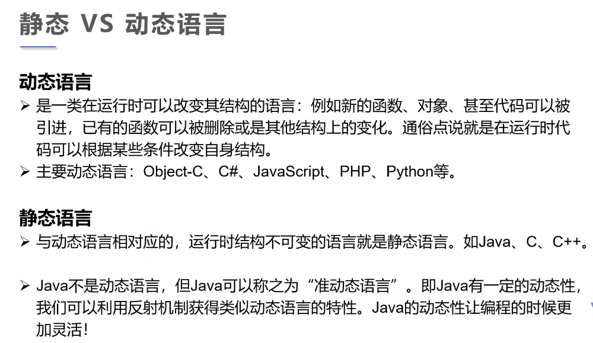

反射机制允许程序在执行期间借助反射的API取得任何类的内部信息并能直接操作任意对象的内部属性及方法。

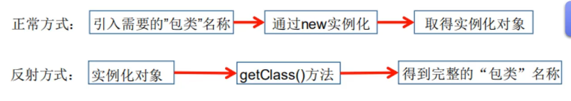

反射相关的主要API：

java.lang.Class:代表一个类

java.lang.reflect.Method:代表类的方法

java.lang.reflect.Field:代表类的成员变量

java.lang.reflect.Constructor:代表类的构造器


```java
//Test02.java
//
public class Test02{
    public static void main(String[] args) throws ClassNotFoundException{
        //通过反射获取类的Class对象
        Class c1 = Class.forName("User");
        System.out.println(c1);
        
        //一个类在内存中只有一个Class对象
        //一个类被加载后，类的整个结构都会被封装在Class对象中。
        System.out.println(c1.hashCode());
    }
}

//实体类  只定义了属性
class User{
    private String name;
    private int id;
    private int age:

	public User(){
    }
	public User(String name,int id,int age){
        this.name = name;
        this.id = id;
        this.age = age;
    }
    public String getName(){
        return name;
    }
    public void setName(String name){
        this.name = name;
    }
    public int getId(){
        return id;
    }
    public void setId(int id){
        this.id = id;
    }
    public int getAge(){
        return age;
    }
    public void setAge(int age){
        this.age = age;
    }
}


```

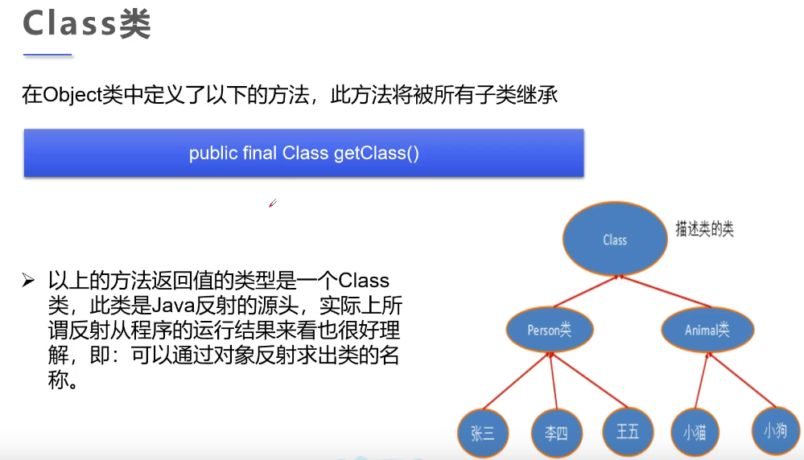

Class类是反射的根源，针对任何想动态加载、运行的类，唯有先获得相应的Class对象。

Class对象包含了特定某个结构（class/interface/enum/annotation/primitive type/void/[]）的有关信息。

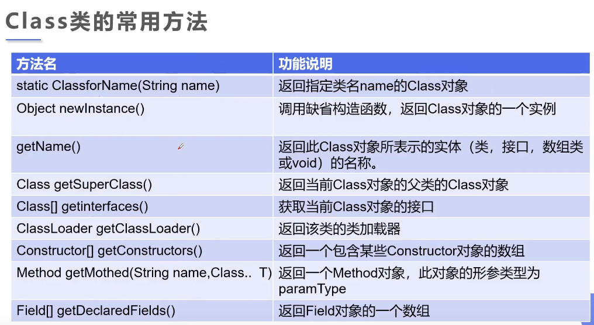

```java
public class Test03 {
    private static void main(String[] args) {
        Person person = new Student();
        System.out.println("这个人是:" + person.name);

        // 方式一：通过对象获得
        Class c1 = person.getClass();
        System.out.println(c1.hashCode());

        // 方式二：forname获得
        Class c2 = Class.forName("Student");
        System.out.println(c2.hashCode());

        //方式三：通过类名.class获得
        Class c3 = Student.class;
        System.out.println(c3.hashCode());

        //方式四：基本内置类型的包装类都有一个Type属性
        Class c4 = Integer.TYPE;
        System.out.println(c4);

        //获得父类类型
        Class c5 = c1.getSuperclass();
        System.out.println(c5);
    }
}

class Person {
    public String name;

    public Person() {

    }

    public Person(String name) {
        this.name = name;
    }

    @Override
    public String toString() {
        return "Person{" + "name='" + name + '\'' + "}";

    }
}

class Student extends Person {
    public Student() {
        this.name = "学生";
    }
}

class Teacher extends Person {
    public Teacher() {
        this.name = "老师";
    }
}
```

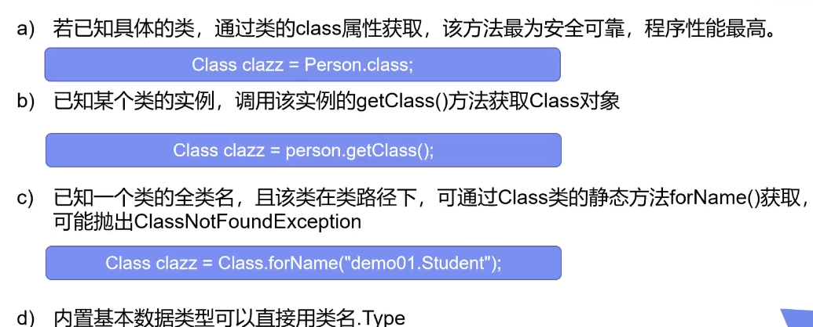


https://www.bilibili.com/video/BV12J41137hu?p=65&spm_id_from=pageDriver (7-13没听)

https://www.bilibili.com/video/BV1p4411P7V3


## Java反序列化的学习

Java反序列化应从两方面开始学：复现漏洞初识Java反序列化，再从开发的角度学习反序列的点并分析原因。

开发的角度 功能复现  正常的序列化


静态成员变量不能被序列化。

序列化时针对对象属性的，而静态成员变量是属于类的。

还要注意transient不能被序列化。


为什么会产生安全问题？

只要服务端反序列化数据，客户端传递类的readObject方法中代码会自动执行，给予攻击者在服务器上运行代码的能力。


可能的形成：

1.入口类的readObject直接调用危险方法。**基本不可能存在**

```java
    private void readObject(ObjectInputStream ois) throws IOException, ClassNotFoundException {
        ois.defaultReadObject();
        Runtime.getRuntime().exec("calc");
    }
```

2.入口类参数中包含可控类，该类有危险方法，readObject时调用。**也很少，一般会找jdk自带的类 更安全**   想到Map、HashMap 会重写一个readObject


3.入口类参数中包含可控类，该类又调用其他有危险方法的类，readObject时调用。（套娃）

比如类型定义为Object，调用equals/hashcode/toString

重点 相同类型 同名函数

B.f

A[O] --> O.f（把B.f传进去就成功了）

一般 A[O] --> O.abc 没拼上

但当O是动态代理类 O[2] invoke ->O.f  就可以把B.f传进去 变成O[B] invoke ->B.f 

因为是动态代理 所以不管外面调用什么方法，都会传回去invoke方法所以成功

readObject > 反序列话自动执行

invoke > 有函数调用


4.构造函数/静态代码块等类加载时隐式执行。


共同条件 继承Serializable

入口类 source（重写readObject 调用常见的函数 参数类型宽泛 最好jdk自带）

调用链 gadget chain 相同名称 相同类型

执行类 sink （rce ssrf 写文件等）最重要


ysoserial 反序列化的工具 有一些利用链

HashMap-->resdObject-->hash 找到object 里面含有hashcode()

URLDNS 当服务器存在一个反序列化的点时，把这个传进去，就会发起一个DNS请求，验证服务器有漏洞。

URL--->openConnection-->返回URLConnection 实现时HttpURLConnection 没有发现什么 而且相同函数名称很少

URL-->hashCode-->handler-->URLStreamHandler 找hashCode  找到getHostAddress(根据域名获取地址 解析工作)  所以我们用到URL的hashCode方法就会存在这个功能

put-->会发现hash -->hashcode 就已经有了一个dns请求 

再回到URL里面查看hashcode 改变了值

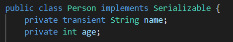


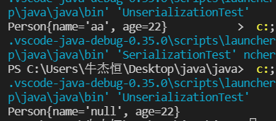

**类加载机制**

1、类加载与反序列化

类加载的时候会执行代码

初始化：静态代码块

实例化：构造代码块、无参构造函数

2、动态类加载方式

Class.forname

初始化/不初始化

ClassLoader.loadClass不进行初始化

底层的原理，实现加载任意的类

**双向委派模型**

Bootstrap ClassLoader：系统类加载器，加载java.lang等

子集Extension ClassLoader：扩展类加载器，加载一些扩展包

子集Application ClassLoader：平常用的、当前路径

继承关系：ClassLoader->SecureClassLoader->URLClassLoader->AppClassLoader

调用关系：loadClass->findClass(子类中重写的)->defineClass(字节码加载类)


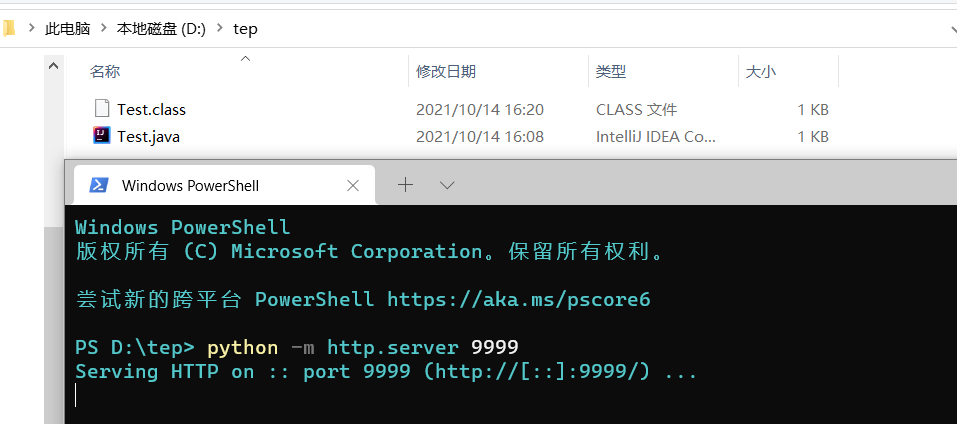


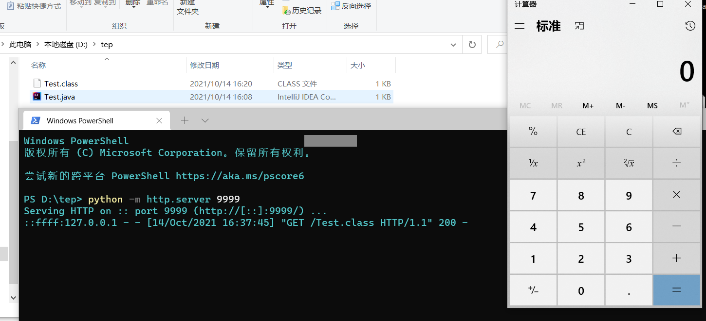

URLClassLoader  任意类加载：file/http/jar

ClassLoader.defineClass 字节码加载任意类私有

Unsafe.defineClass 字节码加载 虽然是public 但是类不能直接生成(Spring里面可以直接生成)


### 反射

反射的作用：让java具有动态性 (类似于照妖镜，显示出本质的东西)

定制需要的对象

通过invoke调用除了同名函数以外的函数

通过Class类创建对象，引入不能序列化的类


https://blog.csdn.net/mocas_wang/article/details/107621010

https://juejin.cn/post/6844903954774491144#heading-5


```java
//Person.java
import java.io.IOException;
import java.io.ObjectInputStream;
import java.io.Serializable;

public class Person implements Serializable {
    // private transient String name;
    public String name;
    private int age;

    public Person() {

    }

    public Person(String name, int age) {
        this.name = name;
        this.age = age;
    }

    @Override // 注解 有功能的注释 重写
    public String toString() {
        return "Person{" + "name='" + name + '\'' + ", age=" + age + '}';
    }

    // private void readObject(ObjectInputStream ois) throws IOException,
    // ClassNotFoundException {
    // ois.defaultReadObject();
    // Runtime.getRuntime().exec("calc");
    // }

}


//SerializationTest.java
import java.io.*;
import java.util.Map;
import java.util.HashMap;
import java.util.jar.Attributes.Name;

public class SerializationTest {
    public static void serializa(Object obj) throws IOException {
        // 实例化对象 初始化值
        // 文件输出流 调用方法序列化
        ObjectOutputStream oos = new ObjectOutputStream(new FileOutputStream("ser.bin"));
        oos.writeObject(obj);
    }

    public static void main(String[] args) throws Exception {
        Person person = new Person("aa", 22);
        System.out.println(person);
        // HashMap a = new HashMap<>();
        // serializa(person);
    }
}


//UnserializationTest.java
import java.io.FileInputStream;
import java.io.IOException;
import java.io.ObjectInputStream;

public class UnserializationTest {
    public static Object unserialize(String Filename) throws IOException, ClassNotFoundException {
        ObjectInputStream ois = new ObjectInputStream(new FileInputStream(Filename));
        Object obj = ois.readObject();
        return obj;
    }

    public static void main(String[] args) throws Exception {
        Person person = (Person) unserialize("ser.bin");
        System.out.println(person);
    }
}


```


## SQL注入

可能的注入点:

get index.html  是一个静态的页面 肯定没有注入点

与后端有交互的点(前端的输入，可能通过后台处理)

类型：

In-band SQLi(Classic SQLi)

Error-based SQLi

Union-based SQLi

Time-based Blind SQLi

Boolean-based Blind SQLi

Stacked injections

==不区分大小写，不懂的函数自己查。==

### SQL 语法

> Mysql

**查询**

注释:

```mysql
-- comments
/* comments */
# comments  (mysql特有的注释符)
```

sql注入通常是查数据

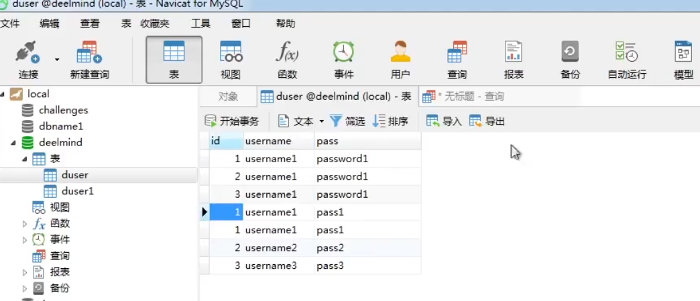

id、username、pass就是字段

查询表中数据：

```mysql
select * from duser(表名)  查所有的
或者
select id,username,pass from duser(表名)

select * from duser where id=1(字段(列表名) 操作符 值)

select * from duser where id in (3); 与id=3相同，所以当网站过滤=以后可以用in。

select * from duser where username > "username1" 也可以用字符串查询"username1"

AND	& &&
OR	| ||

select * from duser where username is null #在duser表中，查询username为空字段的表格
```


| 操作符  | 描述                       |
| :------ | :------------------------- |
| =       | 等于                       |
| <>      | 不等于                     |
| >       | 大于                       |
| <       | 小于                       |
| >=      | 大于等于                   |
| <=      | 小于等于                   |
| BETWEEN | 在某个范围内               |
| LIKE    | 搜索某种模式               |
| IN      | 指定针对某个列的多个可能值 |

去重：

```mysql
select DISTINCT username字段(列表名) from duser表名
```

模糊查找：

```mysql
select * from duser where pass like "word%"	 在表名为duser的情况下，向后匹配pass字段中包含word的
select * from duser where pass like "%word"	 ~~~向前匹配pass字段中包含word的
select * from duser where pass like "%word%" ~~~向前和向后同时匹配pass字段中包含word的
select * from duser where pass like "_word%"  "_"表示占位符，一个就是占一位，第一个字母可以是任意但接下来的四个必须是word。同理"__word"，前两个字母任意但是接下来的四个字母是word。"_"可以放任意位置。
```

**排列方式**

```mysql
#order by
select * from duser order by 3  #可以查询出有几列，如果3正常输出，4报错，则得出有3列

select * from duser order by id desc #desc指倒叙，id倒叙排列

select * from duser order by id desc limit 3 #倒叙的前三条
```

**重命名**

```mysql
#Aliases可以简写为as
select id as idd from duser #将id字段命名为idd
select id idd from duser #当去掉as也可以实现重命名
#注意重命名的时候as可以去掉
```

**函数**

```mysql
#max()、min()
select max(id) from duser #从duser表中查询id的最大的字段
select min(id) from duser #从duser表中查询id的最小的字段
#count()个数、avg()平均值、sum()总数

#concat拼接
SELECT CONCAT("SQL ", "Tutorial ", "is ", "fun!") AS ConcatenatedString; #连接字符串命名为ConcatenatedString字段
#当然也可以把as去掉，结果是一样的。
SELECT CONCAT("SQL ", "Tutorial ", "is ", "fun!") ConcatenatedString
```

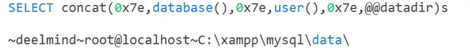

```mysql
#database()
select database() #函数返回当前数据库的名称。如果当前没有数据库，该函数返回NULL 或""。
#user()
select user()  #返回 MySQL 连接的当前用户名和主机名：
#@@datadir
select @@datadir #返回数据库存储在本机的位置
```

**EXISTS**

```MYSQL
#该EXISTS运算符用于测试子查询中是否存在任何记录。
#该EXISTS运算符返回true，如果子查询返回一个或多个记录。
```

**UNION**

```MYSQL
#该UNION运算符用于组合两个或多个SELECT 语句的结果集
select * from duser union select * from duser1 #将duser和duser1表合并展示
#其中的每个SELECT语句 UNION必须具有相同的列数
#列也必须具有相似的数据类型
#每个SELECT语句中的列也必须按相同顺序排列
#UNION也有去重的功能
#不去重用UNION ALL
```

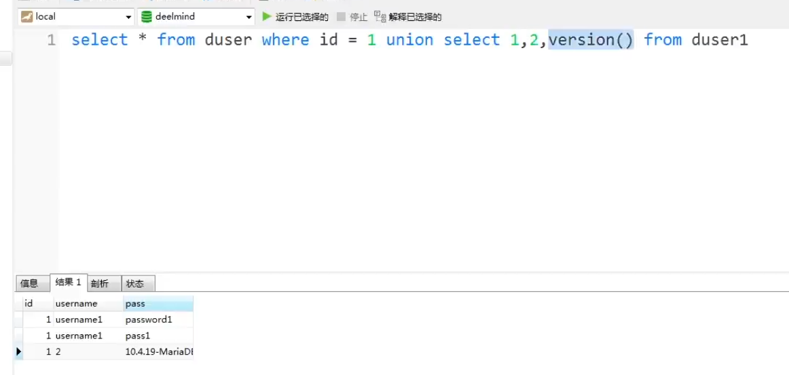

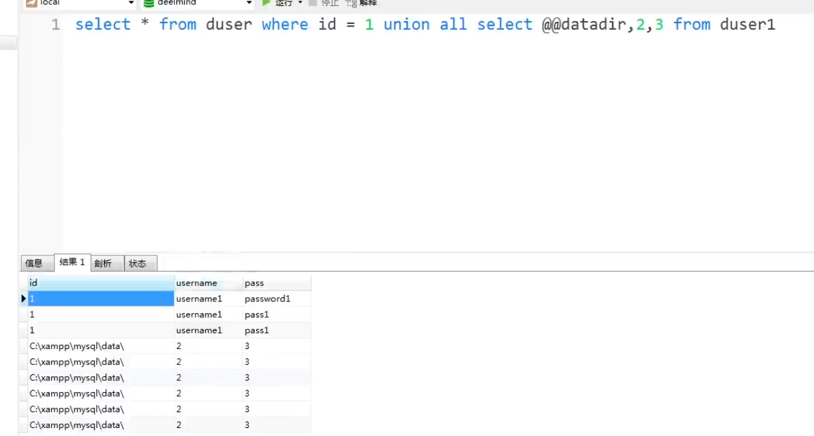

**GROUP BY**

```MYSQL
#该GROUP BY语句将具有相同值的行分组为汇总行，例如“查找每个国家/地区的客户数量”。
#该GROUP BY语句通常与聚合函数 ( COUNT(), MAX(), MIN(), SUM(), AVG()) 一起使用， 以按一列或多列对结果集进行分组。
select count(username)count , id , username , pass from duser group by pass
#从duser这个表中，对pass进行排序，并计算每个pass对应username的个数。
```

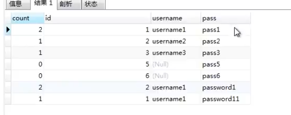

```mysql
select count(username)count , id , username , pass from duser group by username having count = 5
#从duser这个表中，对pass进行排序，并计算每个username对应username的个数。只展示对应为5个g个数的表格。
```

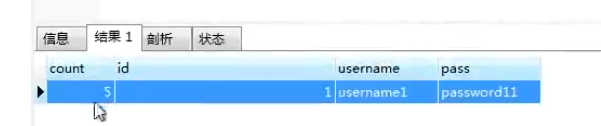

**INNER JOIN**

```mysql
#选择在两个表中具有匹配值的记录.
select * from duser inner join duser1 on duser.id=duser1.id

select * from duser left inner join duser1 on duser.id=duser1.id 
#left  就是左边的都显示，右边没有就是空
#right 就是右边的都显示，左边没有就是空
```

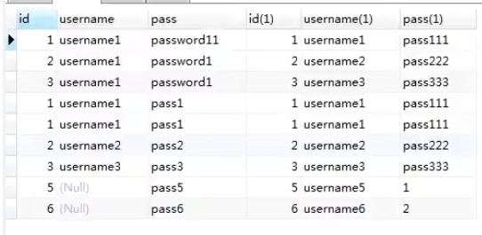

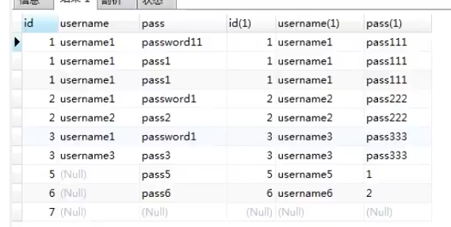

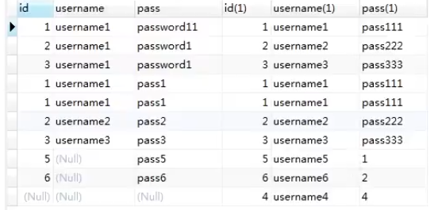

```mysql
#选择出duser中id值比duser1中id值都大的表格
select * from duser where id > all (select id from duser1)
#选择出只要duser中id值比duser1其中一个id值大的
select * from duser where id > any (select id from duser1)
```

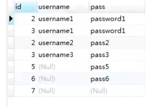


[在线学习代码w3schools](https://www.w3schools.com/default.asp)


